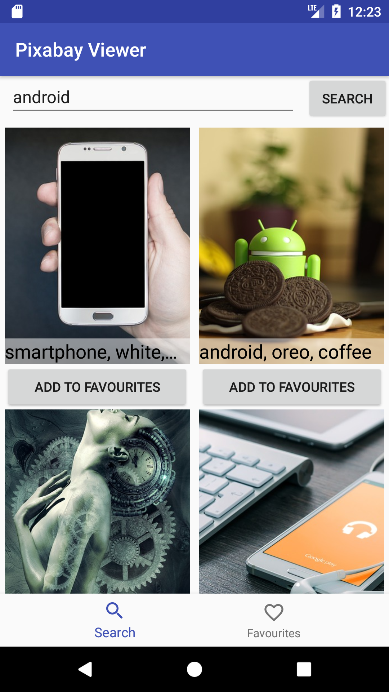
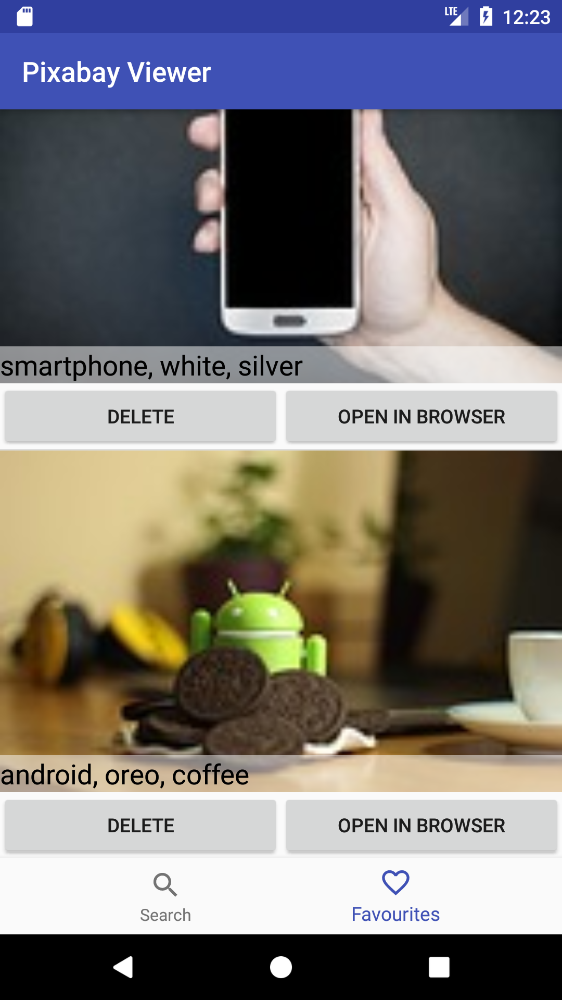
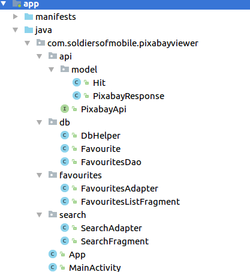

# Pixabay Viewer
## Zadanie 2


Zadanie domowe 2 polega na utworzeniu aplikacji do przeglądania zdjęć z serwisu Pixabay. 
Aplikacja składa się z dwóch ekranów:

### Wyszukiwanie w postaci siatki (2 kolumny)



Po wpisaniu hasła do pola tekstowego i naciśnięciu przycisku SEARCH, dane pobierane są z API i wyświetlane na ekranie w kontrolce GridView.
Każde ze zdjęć może zostać oznaczone jako ulubione. Dane te zapisywane są w lokalnej bazie SQLite.

### Wyświetlanie ulubionych w postaci listy

Wszystkie potrzebne dane o ulubionych zdjęciach, które zostały zapisane są wyświetlane w postaci listy. Każdy z elementów może być otwarty w przeglądarce lub usunięty z ulubionych.

### Baza danych
Baza danych zapisana jest w pliku 'pixabay.db' i zawiera jedną tabelę:
```sqlite
CREATE TABLE favourites (id INT PRIMARY KEY NOT NULL,preview_url TEXT NOT NULL, page_url TEXT NOT NULL, tags TEXT NOT NULL);
```

### API
Do pobrania wyników dla podanego hasła np. android, należy użyć metody API:
```
https://pixabay.com/api/?key=GETME&image_type=photo&q=android
```
Potrzebny klucz API można uzyskać na stronie dokumentacji API, po wcześniejszej rejestracji:
```
https://pixabay.com/api/docs/
```

### Proponowana struktura pakietów


## Punktacja

Każdy z punktów oznacza 1 punkt. Punkty się sumują. Dodatkowo można otrzymać 5 punktów za ulepszenia nie zawarte w przykładzie.

1. Dolna nawigacja jak na screenshotach, przełącza pomiędzy fragmentami.
2. Ekran Search zawiera wrzystkie elementy.
3. Zapytanie do API wykonuje się z odpowiednimi parametrami.
4. Na ekranie search pojawiają się tagi z każdego z wyników.
5. Na ekranie search pojawiają się obrazki z serwisu Pixabay w wynikach.
6. Aplikacja tworzy bazę danych sqlite z odpowiednią tabelą.
7. Aplikacja zapisuje informacje o ulubionym obrazku w bazie.
8. Na ekranie ulubionych wyświetlane są elementy z bazy w postaci listy.
9. Link do obrazka można otworzyć w przeglądarce.
10. Informację o ulubionym obrazku można usunąć z bazy klikając przycisk DELETE.
11. Aplikacja ma domyślny język angielski i dodatkowy język polski.